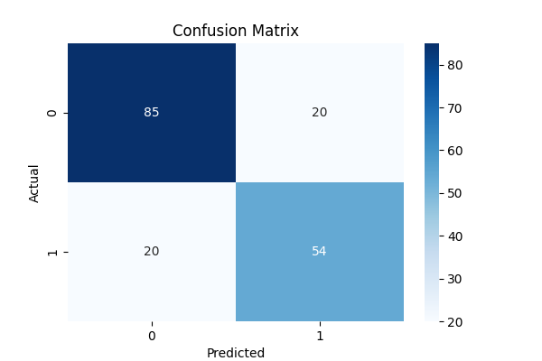

# Predictive Modeling Using Machine Learning

## Overview

This project demonstrates supervised machine learning using the Titanic dataset.

A Decision Tree Classifier was trained to predict passenger survival based on demographic and travel-related features.

## Technologies Used

- Python
- Pandas
- Scikit-Learn
- Matplotlib
- Seaborn

## Dataset

Titanic Passenger Dataset

## Machine Learning Workflow

1. Data preprocessing
2. Feature selection
3. Train-test split
4. Model training using Decision Tree Classifier
5. Prediction on test data
6. Model evaluation

## Features Used

- Passenger Class (Pclass)
- Sex
- Age
- SibSp
- Parch
- Fare
- Embarked

## Target Variable

- Survived

## Model Performance

Accuracy Achieved: **78.77%**

## Confusion Matrix

## Results

The Decision Tree model successfully predicted passenger survival with approximately 79% accuracy.

## Learning Outcome

This project provided hands-on experience in:

- Supervised Machine Learning
- Classification Algorithms
- Model Training
- Model Evaluation
- Confusion Matrix Analysis
